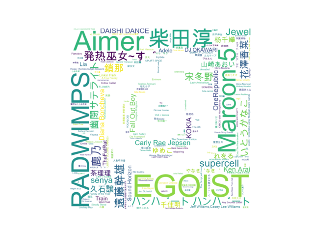
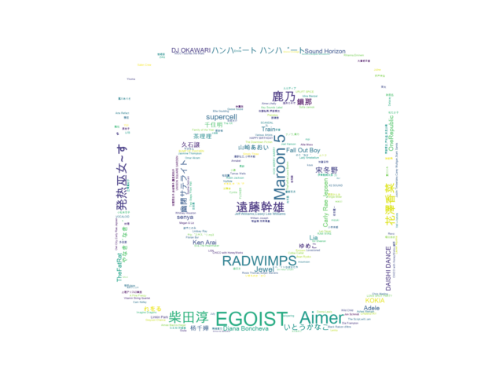

# music_cloud
## 根据歌单，找到自己的音乐坐标！
睡觉时一个突如其来的想法，将自己听的歌画出来！
github地址为：[music_cloud](https://github.com/zqwerty/music_cloud)
目前可以做到的事：绘制歌单中歌手的wordcloud，词频为该歌手歌曲数，效果如下：


## What you need
* 下载歌曲所在文件夹（代码中是对网易云的下载歌曲进行处理，不同软件处理部分可能需要修改）
* 一种支持歌手名字的字体（.ttf格式，github中有一个）
* 背景图片（github中有网易云音乐的图标）
* python 环境
  - PIL
  - numpy
  - matplotlib
  - wordcloud

## How it works
[wordcloud](https://github.com/amueller/word_cloud) 项目地址 
1. 生成字典：{歌手名：所含歌曲数}
2. 生成mask：从图片导入
3. 使用 wordcloud 绘制


```python
#-*- coding:utf-8 -*-
import os
from PIL import Image
import numpy as np
import matplotlib.pyplot as plt
from wordcloud import WordCloud, STOPWORDS, ImageColorGenerator


def draw_music_cloud(music_dir='/Users/zhuqi/Music/网易云音乐', mask_path='mask/163Music6.png', font_path='Arial Unicode.ttf'):
    '''
    draw_music_cloud
    :param music_dir: music dir
    :param mask_path: mask picture dir (background)
    :param font_path: font path
    :return:
    '''
    singer = {}
    for root,dirs,files in os.walk(music_dir):
        songs = [x.split(' - ')[0].decode('UTF-8') for x in files if '.mp3' in x]
        for song in songs:
            if song in singer:
                singer[song] += 1
            else:
                singer[song] = 1

    # print sorted(singer.iteritems(),key=lambda d:d[1],reverse=True)

    mask = np.array(Image.open(mask_path))
    image_colors = ImageColorGenerator(mask)

    wc = WordCloud(background_color="white", font_path=font_path, mask=mask).generate_from_frequencies(singer)
    plt.imshow(wc, interpolation="bilinear")
    plt.axis("off")
    plt.figure()
    # recolor wordcloud and show
    # we could also give color_func=image_colors directly in the constructor
    plt.imshow(wc.recolor(color_func=image_colors), interpolation="bilinear")
    plt.axis("off")
    plt.figure()
    # bg picture
    plt.imshow(mask, cmap=plt.cm.gray, interpolation="bilinear")
    plt.axis("off")
    plt.show()


if __name__ == '__main__':
    draw_music_cloud()
```

## demo
github 中 result 文件夹下






## Future work
未来也许可以推出歌曲的wordcloud，如果网易云提供导出歌曲聆听次数的方法的话。
